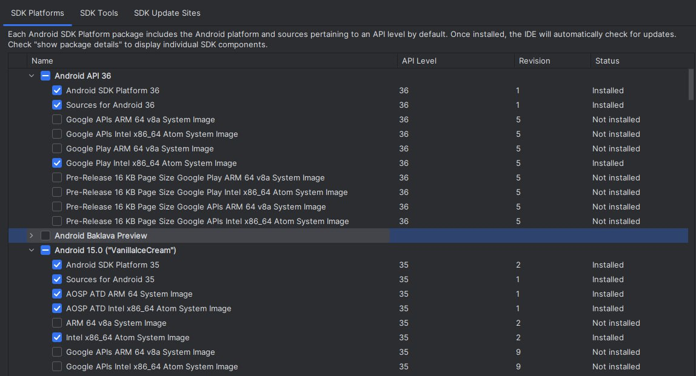
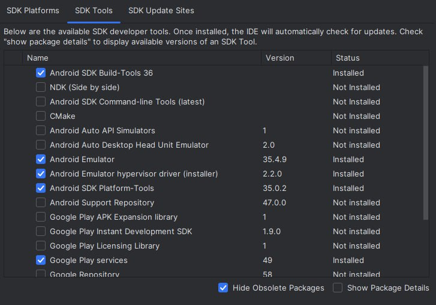
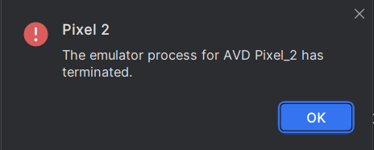
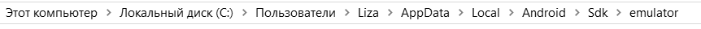
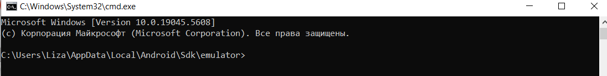
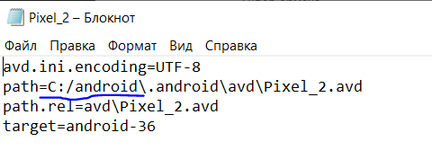

# Welcome to your Expo app 👋

This is an [Expo](https://expo.dev) project created with [`create-expo-app`](https://www.npmjs.com/package/create-expo-app).

## Get started

1. Install dependencies

   ```bash
   npm install
   ```

2. Start the app

   ```bash
    npx expo start
   ```

In the output, you'll find options to open the app in a

- [development build](https://docs.expo.dev/develop/development-builds/introduction/)
- [Android emulator](https://docs.expo.dev/workflow/android-studio-emulator/)
- [iOS simulator](https://docs.expo.dev/workflow/ios-simulator/)
- [Expo Go](https://expo.dev/go), a limited sandbox for trying out app development with Expo

You can start developing by editing the files inside the **app** directory. This project uses [file-based routing](https://docs.expo.dev/router/introduction).

## Get a fresh project

When you're ready, run:

```bash
npm run reset-project
```

This command will move the starter code to the **app-example** directory and create a blank **app** directory where you can start developing.

## Learn more

To learn more about developing your project with Expo, look at the following resources:

- [Expo documentation](https://docs.expo.dev/): Learn fundamentals, or go into advanced topics with our [guides](https://docs.expo.dev/guides).
- [Learn Expo tutorial](https://docs.expo.dev/tutorial/introduction/): Follow a step-by-step tutorial where you'll create a project that runs on Android, iOS, and the web.

## Join the community

Join our community of developers creating universal apps.

- [Expo on GitHub](https://github.com/expo/expo): View our open source platform and contribute.
- [Discord community](https://chat.expo.dev): Chat with Expo users and ask questions.


## Emulator
Для запуска симуляции различных телефонов, нужно зайти в PoweShell (запуск от администратора!)

Проверить защиту:
``` powershell
Get-ExecutionPolicy
```

Результат этой команды:
> Restricted
- защита включена
> Unrestricted
- защита отключена

Нам нужно отключить защиту для установки вспомогательных пакетов. Для этого нужно прописать команду:
```powershell
Set-ExecutionPolicy Unrestricted
```

После отключения защиты прописать команду в PowerShell:
```powershell
Set-ExecutionPolicy Bypass -Scope Process -Force; [System.Net.ServicePointManager]::SecurityProtocol = [System.Net.ServicePointManager]::SecurityProtocol -bor 3072; iex ((New-Object System.Net.WebClient).DownloadString('https://community.chocolatey.org/install.ps1'))
```
Данной командоой устанавливаем `chocolatey` для работы с симуляцией. Ждём установку и прописываем команду:
```powershell
choco install -y nodejs-lts microsoft-openjdk17
```

Внимание! Данная команда сработает только если у Вас стоит Node.js (минимальная версия 18)

Далее устанавливаем `Android Studio` с официального сайта: <a href="https://developer.android.com/studio?hl=ru" target="_blank">Android Studio</a>

Устанавливаем `Android Studio`, заходим в `More Actions` и переходим в раздел `SDK Manager` и устанавливаем флажки:






После установки пакетов заходим `More Actions` - `Virtual Device Manager`

И нажимаем на `create virtual device +`, чтобы добавить новое устройство, по умолчанию можно выбрать `Pixel 2`. Установить пакеты для конкретной симуляции телефона и запустить.

В случае ошибки:



Нужно зайти в `User` найти папку `AppData` -> `Local` -> `Android` -> `Sdk` -> `emulator`

Нажать на командную строку:



и ввести `cmd`

выскочит командная строка:



ввести команду:
```cmd
emulator.exe -avd Pixel_2
```
последнее слово это название вашего устройства.

Ошибка не исчезнет, если вы не зайдёте в папку `User` -> `.android` -> `avd` -> `название устройства (не папка)`:



Изменить путь файлов emulator на корень C-диска. А саму папку `(название устройства).avd` скопировать и перенести в корень С-диска

И проделать в папке `User` -> `AppData` -> `Local` -> `Android` -> `Sdk` -> `emulator`

Нажать на командную строку:


и ввести `cmd`

выскочит командная строка:


ввести команду:
```cmd
emulator.exe -avd Pixel_2
```

Запуск симуляции произойдёт, появится симуляция телефона и после включения нужно будет скачать приложение `expo go` для синхронизации с кодом.
